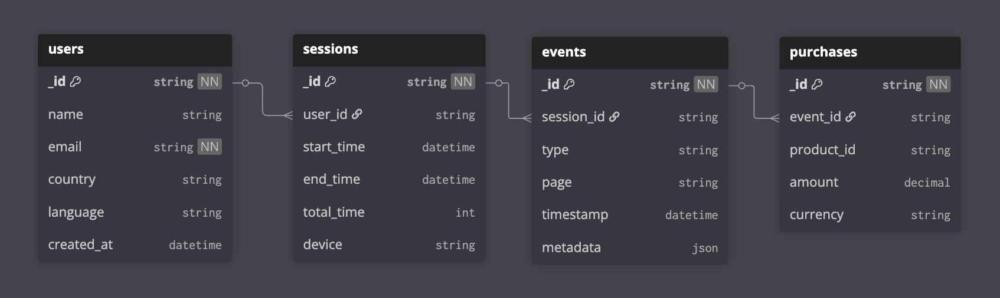
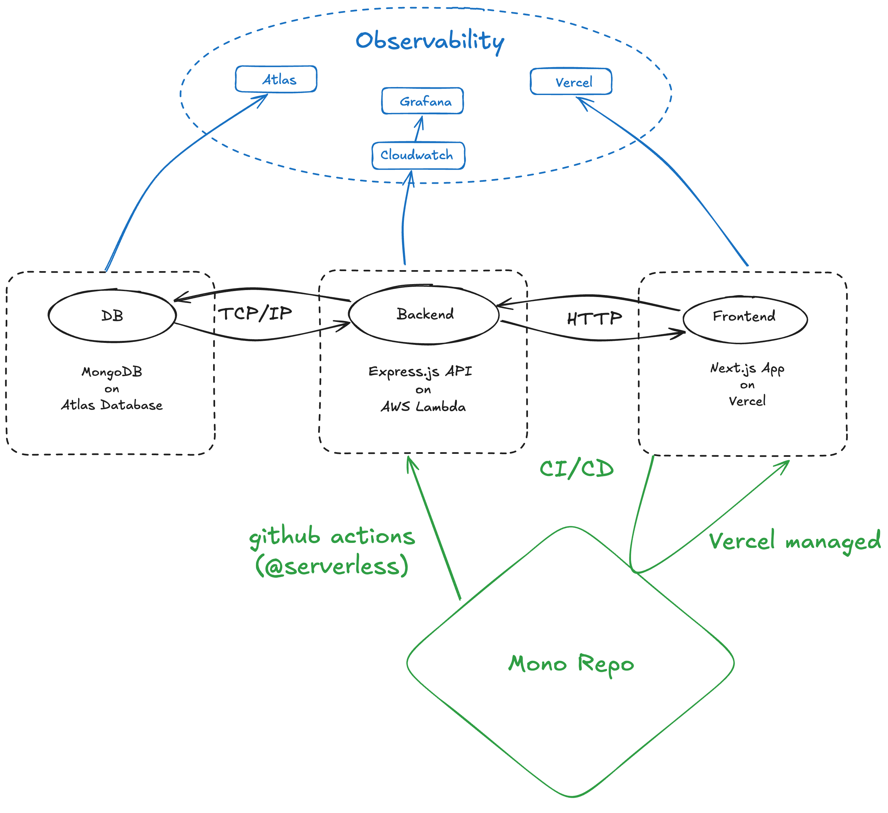

# Customer tracking platform assignment
This project is a monorepo including the components of a full-stack customer tracking application. 
The repository is split into two parts:
- [apps/...](/apps) including all the <i>launchables</i>, that are to be deployed and hosted as a part of the infrastructure
- [packages/...](/packages/) including utility/configurational packages eliminating redundancy within the project.

[Turbo](turborepo.com) is used to ensure a smooth developer experience as well as reliable pipelines necessary for CI/CD integrations.


### Selected levels

- [x] DB: **L2**:
  - as the core of the project I set up the *must have* part first to allow development of other parts in time
- [x] Backend/API: L3
  - main focus was to have it ready for local development and develop further along the frontend if needed, then deploy in the end together with the frontend.
- [x] Cloud/DevOps: L3 (partly L4)
  - deployment were included in other tasks, so it was no question to add a few pipelines extra
- [x] Frontend: L3
  - one of the most timeconsuming, the level was not really a choice, I got as far as my time allowed.
- [x] System Services Monitoring and Support L4
  - little extra, since im already familiar with grafana
  
#### Challenges
- [x] System active users increased by 10 times.
  - Scalability is always a primary concern
- [x] The System should be highly available 247, with different environments.
  - Deployment pipelines and setups allow for convenient environment handling and quick deployments. 

***

### Database

>Mongo database hosted on AWS via [mongoDB Atlas](https://www.mongodb.com/products/platform/atlas-database).

#### Data structure



See [packages/db](packages/db) for mongoose `schema/client` implementation.


### Particular decisions/Notes to self

- **separation of db models:** follows principle of **"queried together, kept together"**
- **paginated queries:** listed search results can be longer so pagination is required. **Offset based pagination can heavily increase CPU usage** as page number increases, which ideally should not happen but assuming the worst, one "bad" user can hinder the performance of the DB (skipping to page 129 of a poorly targeted search). Hence **cursor based pagination is required**.
  

### Local Development
Backend requries `MONGODB_URI` env var provided. (in `.env.local` at root for below script to work)

Frontend requires `.env.local` file in `apps/tracking-platform/` including 
```bash
 yarn
# provide env -- turbo dev eg.:
 npx env-cmd -f  ./.env.local -- turbo dev
 ```

 ### Deployment
 Lambda deployment is covered by github actions leveraging the serverless framework. 
 The frontend is deployed through vercel.

 Both automatically on push. (lambda currently only deployed on pushes to the `origin/dev` branch )

 ### System architecture



