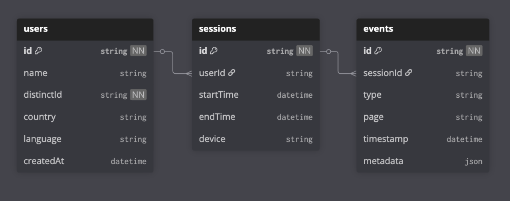

# Customer tracking platform assignment
This project is a monorepo including the components of a full-stack customer tracking application. 
The repository is split into two parts:
- [apps/...](/apps) including all the <i>launchables</i>, that are to be deployed and hosted as a part of the infrastructure
- [packages/...](/packages/) including utility/configurational packages eliminating redundancy within the project.

[Turbo](turborepo.com) is used to ensure a smooth developer experience as well as reliable pipelines necessary for CI/CD integrations.

### Selected levels

- [x] DB: L2
- [ ] *Backend/API: L3*
- [ ] *Cloud/DevOps: L4*
- [ ] *Frontend: L3*
  
***

### Database

>Mongo database hosted on AWS via [mongoDB Atlas](https://www.mongodb.com/products/platform/atlas-database).

#### Data structure

See [packages/db](packages/db) for mongoose `schema/client` implementation.

### Particular decisions/Notes to self

- **separation of db models:** follows principle of **"queried together, kept together"**
- **paginated queries:** listed search results can be longer so pagination is required. **Offset based pagination can heavily increase CPU usage** as page number increases, which ideally should not happen but assuming the worst, one "bad" user can hinder the performance of the DB (skipping to page 129 of a poorly targeted search). Hence **cursor based pagination is required**.
  